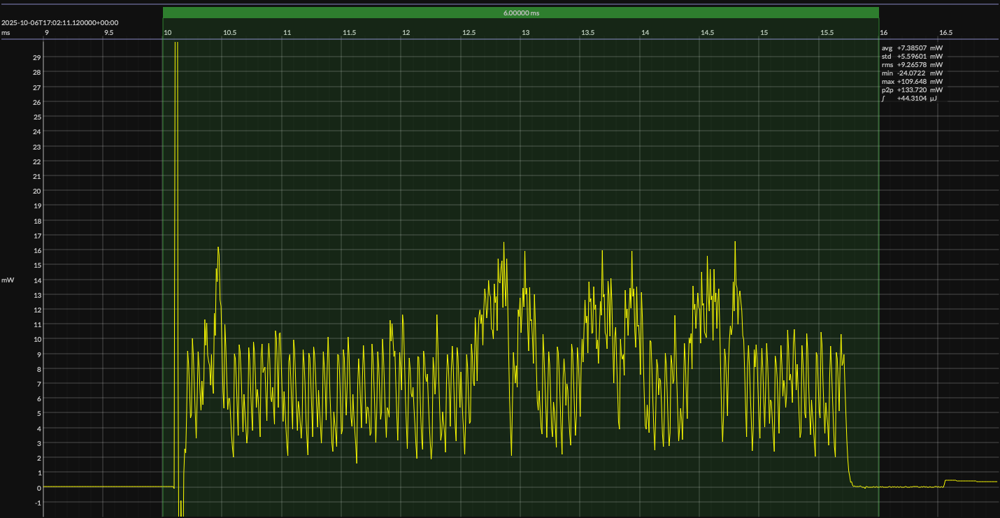

<!-- GENERATED FILE — DO NOT EDIT -->

<h1 align="center">Analog Devices MAX32655 Evaluation Kit · CodeFusion Studio</h1>
<h3 align="center">Bench supply · 3V3</h3>

captured on 2025-08-17 @ 01:38:00 generated on 2026-07-29 @ 00:49:42

## Platform

- Board: Analog Devices MAX32655 Evaluation Kit
- MCU: Analog Devices MAX32655
- CPU: 100 MHz Arm Cortex-M4
- Flash: 512 KB
- SRAM: 128 KB
- Development environment: CodeFusion Studio
- CodeFusion Studio: 1.1.0

### References

- [MAX32655 Evaluation Kit](https://www.analog.com/en/resources/evaluation-hardware-and-software/evaluation-boards-kits/max32655evkit.html)
- [MAX32655 SoC](https://www.analog.com/en/products/max32655.html)
- [CodeFusion Studio](https://www.analog.com/en/resources/evaluation-hardware-and-software/embedded-development-software/codefusion-studio.html)
- [BUILD ARTIFACTS](../build)

## EM&bull;Scope results · JS220

### 🟠&ensp;sleep

| supply voltage | &emsp;current (avg)&emsp; | &emsp;current (std)&emsp; | &emsp;average power&emsp;
|:---:|:---:|:---:|:---:|
| 3.3 V |  4.4 µA |  0.9 µA | 14.6 µW |

### 🟠&ensp;1&thinsp;s event period

| &emsp;&emsp;event energy (avg)&emsp;&emsp; | &emsp;&emsp;energy per period&emsp;&emsp; | &emsp;&emsp;energy per day&emsp;&emsp; | &emsp;&emsp;&emsp;**EM&bull;eralds**&emsp;&emsp;&emsp;
|:---:|:---:|:---:|:---:|
| 47.4 µJ | 62.0 µJ |  5.4 J | 14.94 |

### 🟠&ensp;10&thinsp;s event period

| &emsp;&emsp;event energy (avg)&emsp;&emsp; | &emsp;&emsp;energy per period&emsp;&emsp; | &emsp;&emsp;energy per day&emsp;&emsp; | &emsp;&emsp;&emsp;**EM&bull;eralds**&emsp;&emsp;&emsp;
|:---:|:---:|:---:|:---:|
| 47.4 µJ | 193.1 µJ |  1.7 J | 47.94 |

## Typical Event

