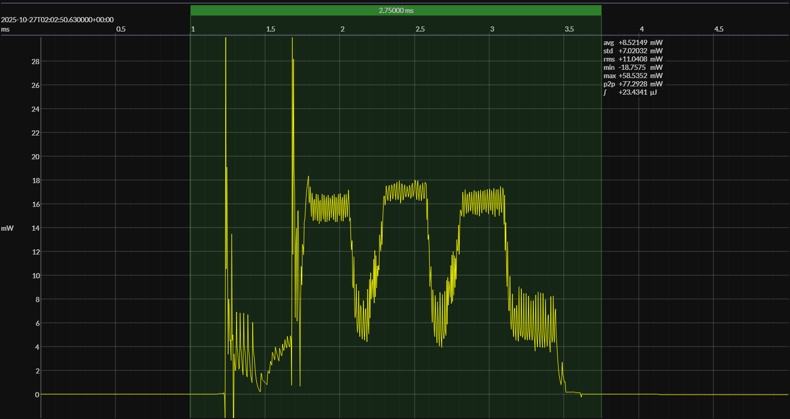

<!-- GENERATED FILE — DO NOT EDIT -->

<h1 align="center">Silicon Labs EFR32xG22E Energy Harvesting Explorer Kit · Simplicity Studio</h1>
<h3 align="center">Bench supply · 3V0</h3>

captured on 2025-10-27 @ 02:01:19 generated on 2026-07-29 @ 00:49:27

## Platform

- Board: Silicon Labs EFR32xG22E Energy Harvesting Explorer Kit
- MCU: Silicon Labs EFR32xG22E
- CPU: 76.8 MHz Arm Cortex-M33
- Flash: 512 KB
- SRAM: 32 KB
- Development environment: Simplicity Studio
- Simplicity Studio: 5

### References

- [xG22-EK8200A](https://www.silabs.com/development-tools/wireless/efr32xg22e-energy-harvesting-explorer-kit?tab=overview)
- [EFR32xG22E SoC](https://www.silabs.com/wireless/bluetooth/efr32bg22-series-2-socs)
- [Simplicity Studio](https://www.silabs.com/software-and-tools/simplicity-studio/simplicity-studio-version-5)
- [BUILD ARTIFACTS](../build)

## EM&bull;Scope results · JS220

### 🟠&ensp;sleep

| supply voltage | &emsp;current (avg)&emsp; | &emsp;current (std)&emsp; | &emsp;average power&emsp;
|:---:|:---:|:---:|:---:|
| 3.0 V |  1.7 µA |  0.9 µA |  4.9 µW |

### 🟠&ensp;1&thinsp;s event period

| &emsp;&emsp;event energy (avg)&emsp;&emsp; | &emsp;&emsp;energy per period&emsp;&emsp; | &emsp;&emsp;energy per day&emsp;&emsp; | &emsp;&emsp;&emsp;**EM&bull;eralds**&emsp;&emsp;&emsp;
|:---:|:---:|:---:|:---:|
| 23.4 µJ | 28.3 µJ |  2.4 J | 32.73 |

### 🟠&ensp;10&thinsp;s event period

| &emsp;&emsp;event energy (avg)&emsp;&emsp; | &emsp;&emsp;energy per period&emsp;&emsp; | &emsp;&emsp;energy per day&emsp;&emsp; | &emsp;&emsp;&emsp;**EM&bull;eralds**&emsp;&emsp;&emsp;
|:---:|:---:|:---:|:---:|
| 23.4 µJ | 72.7 µJ |  0.6 J | 127.44 |

## Typical Event

