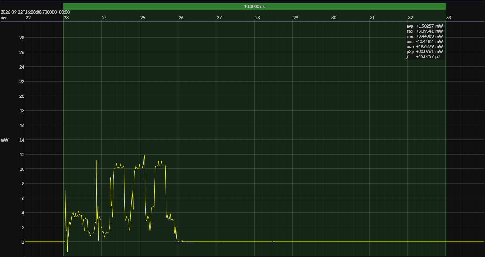

<!-- GENERATED FILE — DO NOT EDIT -->

<h1 align="center">EM Microelectronic EM9305 SOC DVK · EM Bleu SDK</h1>
<h3 align="center">Bench supply · 1V5</h3>

captured on 2025-10-28 @ 03:40:39 generated on 2026-07-30 @ 01:10:53

## Platform

- Board: EM Microelectronic EM9305 SOC DVK
- MCU: EM Microelectronic EM9305
- CPU: 48 MHz ARC EM7D
- Flash: 512 KB
- SRAM: 64 KB
- Software SDK: EM Bleu SDK
- EM Bleu SDK: 4.4.1

### References

- [EM9305 SOC DVK](https://www.emmicroelectronic.com/sites/default/files/products/datasheets/EM9305%20SOC%20DVK%20FACTSHEET.pdf)
- [EM9305 SoC](https://www.emmicroelectronic.com/product/standard-protocols/em-bleu-em9305)
- [EM Bleu SDK](https://www.emmicroelectronic.com/contact-us)
- [BUILD ARTIFACTS](../build)

## EM&bull;Scope results · JS220

### 🟠&ensp;measured voltage

| &emsp;average&emsp; | &emsp;minimum&emsp; | &emsp;maximum&emsp; | &emsp;standard deviation&emsp;
|:---:|:---:|:---:|:---:|
| 1.498 V | 1.485 V | 1.503 V | 0.001 V |

### 🟠&ensp;sleep

| supply voltage | &emsp;current (avg)&emsp; | &emsp;current (std)&emsp; | &emsp;average power&emsp;
|:---:|:---:|:---:|:---:|
| 1.5 V |  0.5 µA |  0.7 µA | 761.6 nW |

### 🟠&ensp;1&thinsp;s event period

| &emsp;&emsp;event energy (avg)&emsp;&emsp; | &emsp;&emsp;energy per period&emsp;&emsp; | &emsp;&emsp;energy per day&emsp;&emsp; | &emsp;&emsp;&emsp;**EM&bull;eralds**&emsp;&emsp;&emsp;
|:---:|:---:|:---:|:---:|
| 15.1 µJ | 15.8 µJ |  1.4 J | 58.54 |

### 🟠&ensp;10&thinsp;s event period

| &emsp;&emsp;event energy (avg)&emsp;&emsp; | &emsp;&emsp;energy per period&emsp;&emsp; | &emsp;&emsp;energy per day&emsp;&emsp; | &emsp;&emsp;&emsp;**EM&bull;eralds**&emsp;&emsp;&emsp;
|:---:|:---:|:---:|:---:|
| 15.1 µJ | 22.7 µJ |  0.2 J | 408.39 |

## Typical Event

