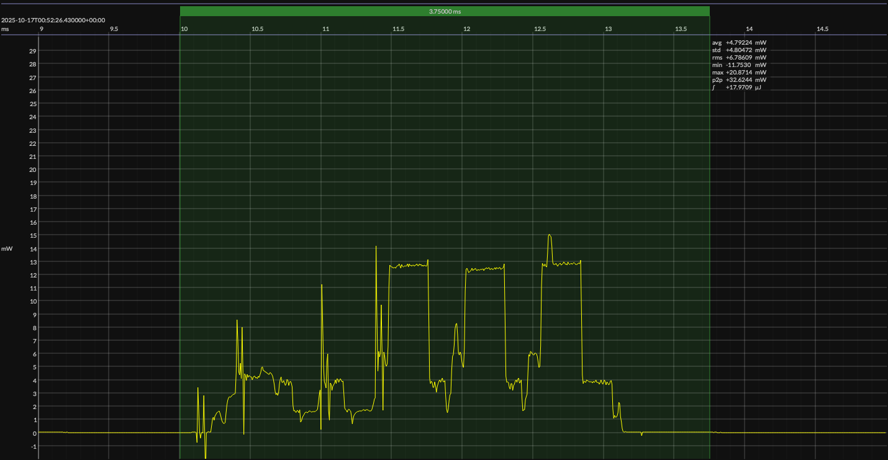

<!-- GENERATED FILE — DO NOT EDIT -->

<h1 align="center">EM Microelectronic EM9305 SOC DVK · EM Bleu SDK</h1>
<h3 align="center">Bench supply · 1V8</h3>

captured on 2025-10-17 @ 00:50:58 generated on 2026-08-13 @ 14:47:57

## Activity

- Activity: Bluetooth Low Energy legacy advertising
- Advertising type: non-connectable, non-scannable (`ADV_NONCONN_IND`)
- PHY: LE 1M
- Advertising channels: 37, 38, and 39
- TX power: 0 dBm
- Advertising interval: 1 s
- Advertising payload length: 19 bytes
- Advertising event: one back-to-back transmission on each of channels 37, 38, and 39
- Flags: LE General Discoverable; BR/EDR not supported
- Local name: `BlueJoule`
- Manufacturer ID: Novel Bits (`0x08D3`)
- Manufacturer data: `0xFF`
- Conformance basis: observable over-the-air behavior, not a canonical source implementation
- Measurement result: average event energy and average event duration derived from repeated detected events
- Sleep model: time outside the measured event is treated as sleep for period and daily-energy projections

## Platform

- Board: EM Microelectronic EM9305 SOC DVK
- MCU: EM Microelectronic EM9305
- CPU: 48 MHz ARC EM7D
- Flash: 512 KB
- SRAM: 64 KB
- Software SDK: EM Bleu SDK
- EM Bleu SDK: 4.4.1

### References

- [EM9305 SOC DVK](https://www.emmicroelectronic.com/sites/default/files/products/datasheets/EM9305%20SOC%20DVK%20FACTSHEET.pdf)
- [EM9305 SoC](https://www.emmicroelectronic.com/product/standard-protocols/em-bleu-em9305)
- [EM Bleu SDK](https://www.emmicroelectronic.com/contact-us)
- [BUILD ARTIFACTS](../build)

## Power Source

- Power source: regulated bench supply
- State of charge: not applicable
- Battery model: none

## EM&bull;Scope results · JS220

### 🟠&ensp;measured voltage

| &emsp;average&emsp; | &emsp;minimum&emsp; | &emsp;maximum&emsp; | &emsp;standard deviation&emsp;
|:---:|:---:|:---:|:---:|
| 1.799 V | 1.789 V | 1.805 V | 0.001 V |

### 🟠&ensp;sleep

| supply voltage | &emsp;current (avg)&emsp; | &emsp;current (std)&emsp; | &emsp;average power&emsp;
|:---:|:---:|:---:|:---:|
| 1.8 V |  0.8 µA |  0.5 µA |  1.5 µW |

### 🟠&ensp;1&thinsp;s event period

| &emsp;&emsp;event energy (avg)&emsp;&emsp; | &emsp;&emsp;event energy (std)&emsp;&emsp; | &emsp;&emsp;energy per period&emsp;&emsp; | &emsp;&emsp;energy per day&emsp;&emsp; | &emsp;&emsp;&emsp;**EM&bull;eralds**&emsp;&emsp;&emsp;
|:---:|:---:|:---:|:---:|:---:|
| 18.0 µJ |  0.0 µJ | 19.5 µJ |  1.7 J | 47.48 |

### 🟠&ensp;10&thinsp;s event period

| &emsp;&emsp;event energy (avg)&emsp;&emsp; | &emsp;&emsp;event energy (std)&emsp;&emsp; | &emsp;&emsp;energy per period&emsp;&emsp; | &emsp;&emsp;energy per day&emsp;&emsp; | &emsp;&emsp;&emsp;**EM&bull;eralds**&emsp;&emsp;&emsp;
|:---:|:---:|:---:|:---:|:---:|
| 18.0 µJ |  0.0 µJ | 33.1 µJ |  0.3 J | 279.62 |

## Typical Event

