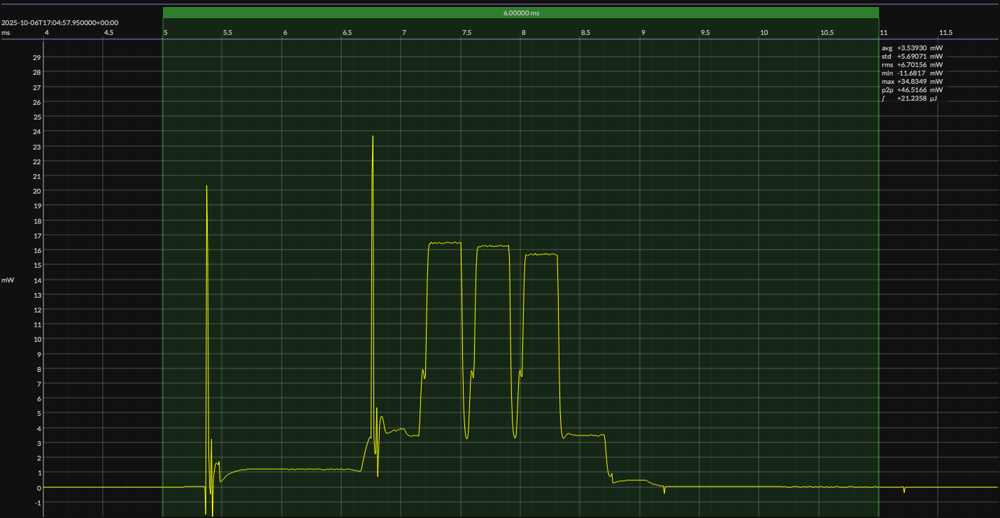

<!-- GENERATED FILE — DO NOT EDIT -->

<h1 align="center">InPlay NanoBeacon™ IN100 Development Kit · NanoBeacon Config Tool</h1>
<h3 align="center">Bench supply · 1V8</h3>

captured on 2025-07-28 @ 01:23:15 generated on 2026-07-30 @ 01:10:55

## Platform

- Board: InPlay NanoBeacon™ IN100 Development Kit
- Device: InPlay IN100
- Architecture: Configurable ASIC
- OTP: 4 Kb
- SRAM: 4 KB
- Configuration tool: NanoBeacon Config Tool
- NanoBeacon Config Tool: 3.2.29

### References

- [IN100 Development Kit](https://inplay-tech.com/in100)
- [IN100 SoC](https://inplay-tech.com/in100)
- [NanoBeacon Config Tool](https://inplay-tech.com/nanobeacon-config-tool)
- [BUILD ARTIFACTS](../build)

## EM&bull;Scope results · JS220

### 🟠&ensp;measured voltage

| &emsp;average&emsp; | &emsp;minimum&emsp; | &emsp;maximum&emsp; | &emsp;standard deviation&emsp;
|:---:|:---:|:---:|:---:|
| 1.823 V | 1.806 V | 1.827 V | 0.000 V |

### 🟠&ensp;sleep

| supply voltage | &emsp;current (avg)&emsp; | &emsp;current (std)&emsp; | &emsp;average power&emsp;
|:---:|:---:|:---:|:---:|
| 1.8 V |  0.5 µA |  0.1 µA | 898.8 nW |

### 🟠&ensp;1&thinsp;s event period

| &emsp;&emsp;event energy (avg)&emsp;&emsp; | &emsp;&emsp;energy per period&emsp;&emsp; | &emsp;&emsp;energy per day&emsp;&emsp; | &emsp;&emsp;&emsp;**EM&bull;eralds**&emsp;&emsp;&emsp;
|:---:|:---:|:---:|:---:|
| 21.2 µJ | 22.1 µJ |  1.9 J | 41.93 |

### 🟠&ensp;10&thinsp;s event period

| &emsp;&emsp;event energy (avg)&emsp;&emsp; | &emsp;&emsp;energy per period&emsp;&emsp; | &emsp;&emsp;energy per day&emsp;&emsp; | &emsp;&emsp;&emsp;**EM&bull;eralds**&emsp;&emsp;&emsp;
|:---:|:---:|:---:|:---:|
| 21.2 µJ | 30.2 µJ |  0.3 J | 306.88 |

## Typical Event

