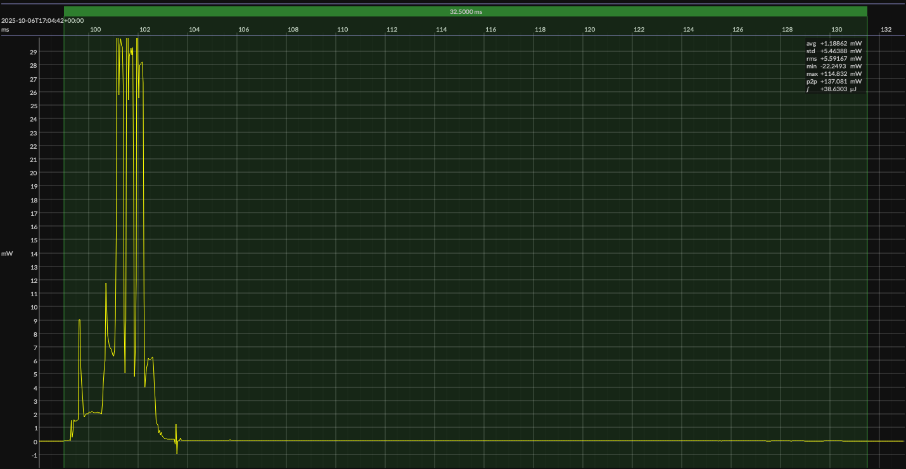

<!-- GENERATED FILE — DO NOT EDIT -->

<h1 align="center">InPlay NanoBeacon™ IN100 Development Kit · NanoBeacon Config Tool</h1>
<h3 align="center">Bench supply · 3V3</h3>

captured on 2025-09-07 @ 20:58:13 generated on 2026-08-13 @ 14:48:04

## Activity

- Activity: Bluetooth Low Energy legacy advertising
- Advertising type: non-connectable, non-scannable (`ADV_NONCONN_IND`)
- PHY: LE 1M
- Advertising channels: 37, 38, and 39
- TX power: 0 dBm
- Advertising interval: 1 s
- Advertising payload length: 19 bytes
- Advertising event: one back-to-back transmission on each of channels 37, 38, and 39
- Flags: LE General Discoverable; BR/EDR not supported
- Local name: `BlueJoule`
- Manufacturer ID: Novel Bits (`0x08D3`)
- Manufacturer data: `0xFF`
- Conformance basis: observable over-the-air behavior, not a canonical source implementation
- Measurement result: average event energy and average event duration derived from repeated detected events
- Sleep model: time outside the measured event is treated as sleep for period and daily-energy projections

## Platform

- Board: InPlay NanoBeacon™ IN100 Development Kit
- Device: InPlay IN100
- Architecture: Configurable ASIC
- OTP: 4 Kb
- SRAM: 4 KB
- Configuration tool: NanoBeacon Config Tool
- NanoBeacon Config Tool: 3.2.29

### References

- [IN100 Development Kit](https://inplay-tech.com/in100)
- [IN100 SoC](https://inplay-tech.com/in100)
- [NanoBeacon Config Tool](https://inplay-tech.com/nanobeacon-config-tool)
- [BUILD ARTIFACTS](../build)

## Power Source

- Power source: regulated bench supply
- State of charge: not applicable
- Battery model: none

## EM&bull;Scope results · JS220

### 🟠&ensp;measured voltage

| &emsp;average&emsp; | &emsp;minimum&emsp; | &emsp;maximum&emsp; | &emsp;standard deviation&emsp;
|:---:|:---:|:---:|:---:|
| 3.292 V | 3.230 V | 3.366 V | 0.002 V |

### 🟠&ensp;sleep

| supply voltage | &emsp;current (avg)&emsp; | &emsp;current (std)&emsp; | &emsp;average power&emsp;
|:---:|:---:|:---:|:---:|
| 3.3 V |  0.6 µA |  0.1 µA |  2.1 µW |

### 🟠&ensp;1&thinsp;s event period

| &emsp;&emsp;event energy (avg)&emsp;&emsp; | &emsp;&emsp;event energy (std)&emsp;&emsp; | &emsp;&emsp;energy per period&emsp;&emsp; | &emsp;&emsp;energy per day&emsp;&emsp; | &emsp;&emsp;&emsp;**EM&bull;eralds**&emsp;&emsp;&emsp;
|:---:|:---:|:---:|:---:|:---:|
| 38.3 µJ |  0.2 µJ | 40.4 µJ |  3.5 J | 22.92 |

### 🟠&ensp;10&thinsp;s event period

| &emsp;&emsp;event energy (avg)&emsp;&emsp; | &emsp;&emsp;event energy (std)&emsp;&emsp; | &emsp;&emsp;energy per period&emsp;&emsp; | &emsp;&emsp;energy per day&emsp;&emsp; | &emsp;&emsp;&emsp;**EM&bull;eralds**&emsp;&emsp;&emsp;
|:---:|:---:|:---:|:---:|:---:|
| 38.3 µJ |  0.2 µJ | 59.6 µJ |  0.5 J | 155.26 |

## Typical Event

