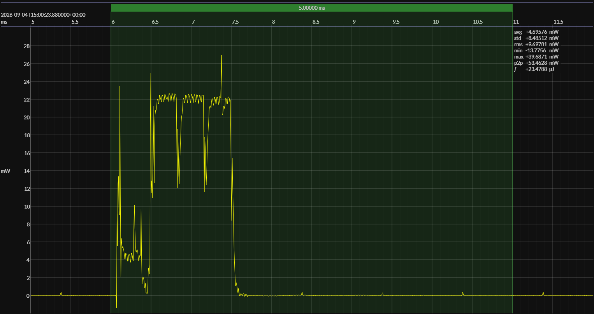

<!-- GENERATED FILE — DO NOT EDIT -->

<h1 align="center">Nordic nRF52 DK · EM•Script</h1>
<h3 align="center">Bench supply · 3V0</h3>

captured on 2026-09-04 @ 14:58:04 generated on 2026-09-04 @ 15:01:13

## Activity

- Activity: Bluetooth Low Energy legacy advertising
- Advertising type: non-connectable, non-scannable (`ADV_NONCONN_IND`)
- PHY: LE 1M
- Advertising channels: 37, 38, and 39
- TX power: 0 dBm
- Advertising interval: 1 s
- Advertising payload length: 19 bytes
- Advertising event: one back-to-back transmission on each of channels 37, 38, and 39
- Flags: LE General Discoverable; BR/EDR not supported
- Local name: `BlueJoule`
- Manufacturer ID: Novel Bits (`0x08D3`)
- Manufacturer data: `0xFF`
- Conformance basis: observable over-the-air behavior, not a canonical source implementation
- Measurement result: average event energy and average event duration derived from repeated detected events
- Sleep model: time outside the measured event is treated as sleep for period and daily-energy projections

## Platform

- MCU: Nordic nRF52832
- CPU: 64 MHz Arm Cortex-M4
- Flash: 512 KB
- SRAM: 64 KB
- Board: Nordic nRF52 Development Kit
- Software environment: EM•Script
- EM•Script SDK: 26.2.0

### References

- [Nordic nRF52832](https://www.nordicsemi.com/Products/nRF52832)
- [Nordic nRF52 DK](https://www.nordicsemi.com/Products/Development-hardware/nRF52-DK)
- [Board pinout](https://github.com/em-foundation/emscope/blob/docs-stable/docs/boards/nrf-52-dk.png)
- [EM•Script project](https://github.com/em-foundation/emporium)

## Power Source

- Power source: regulated bench supply
- State of charge: not applicable
- Battery model: none

## EM&bull;Scope results · JS220

### 🟠&ensp;measured voltage

| &emsp;average&emsp; | &emsp;minimum&emsp; | &emsp;maximum&emsp; | &emsp;standard deviation&emsp;
|:---:|:---:|:---:|:---:|
| 2.998 V | 2.994 V | 3.003 V | 0.001 V |

### 🟠&ensp;sleep

| supply voltage | &emsp;current (avg)&emsp; | &emsp;current (std)&emsp; | &emsp;average power&emsp;
|:---:|:---:|:---:|:---:|
| 3.0 V |  1.0 µA |  9.7 µA |  3.0 µW |

### 🟠&ensp;boundary / closure

| accounting window | sleep window | event duty | closure residual | floor residual |
|:---:|:---:|:---:|:---:|:---:|
| 10.000 s | 0.500 s | 0.500% | 0.755% | -0.1 µA |

### 🟠&ensp;1&thinsp;s event period

| &emsp;&emsp;event energy (avg)&emsp;&emsp; | &emsp;&emsp;event energy (std)&emsp;&emsp; | &emsp;&emsp;energy per period&emsp;&emsp; | &emsp;&emsp;energy per day&emsp;&emsp; | &emsp;&emsp;&emsp;**EM&bull;eralds**&emsp;&emsp;&emsp;
|:---:|:---:|:---:|:---:|:---:|
| 23.5 µJ |  0.0 µJ | 26.5 µJ |  2.3 J | 34.96 |

### 🟠&ensp;10&thinsp;s event period

| &emsp;&emsp;event energy (avg)&emsp;&emsp; | &emsp;&emsp;event energy (std)&emsp;&emsp; | &emsp;&emsp;energy per period&emsp;&emsp; | &emsp;&emsp;energy per day&emsp;&emsp; | &emsp;&emsp;&emsp;**EM&bull;eralds**&emsp;&emsp;&emsp;
|:---:|:---:|:---:|:---:|:---:|
| 23.5 µJ |  0.0 µJ | 53.4 µJ |  0.5 J | 173.33 |

## Typical Event

