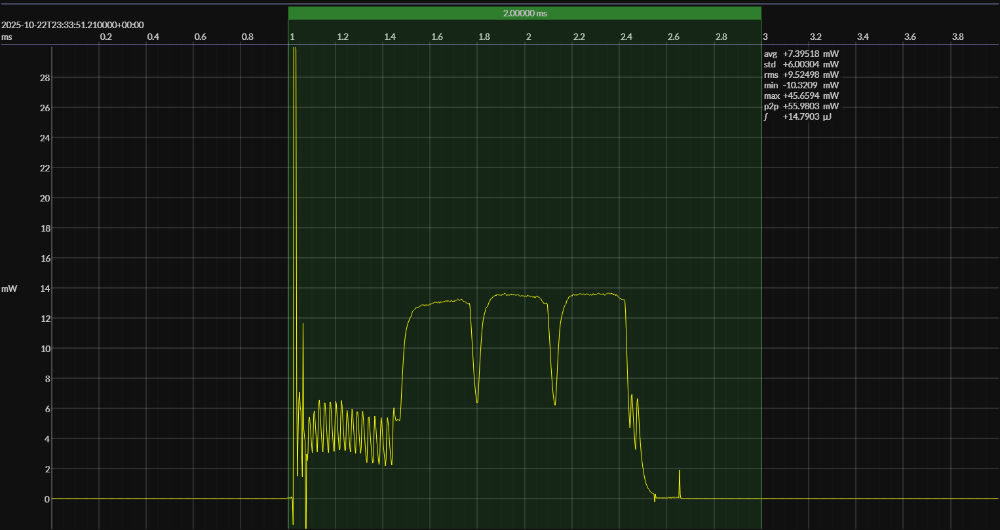

<!-- GENERATED FILE — DO NOT EDIT -->

<h1 align="center">Nordic nRF54L15 DK · EM•Script</h1>
<h3 align="center">Bench supply · 1V8</h3>

captured on 2025-10-22 @ 23:33:00 generated on 2026-07-30 @ 01:11:03

## Platform

- MCU: Nordic nRF54L15
- CPU: Arm Cortex-M33, 128 MHz
- Flash: 1.5 MB
- SRAM: 256 KB
- Board: Nordic nRF54L15 DK
- Software environment: EM•Script
- EM•Script SDK: 26.2.0

### References

- [nRF54L15 product page](https://www.nordicsemi.com/Products/nRF54L15)
- [nRF54L15 DK](https://www.nordicsemi.com/Products/Development-hardware/nRF54L15-DK)
- [EM•Script project](https://github.com/em-foundation/emporium)
- [BUILD ARTIFACTS](../build)

## EM&bull;Scope results · JS220

### 🟠&ensp;measured voltage

| &emsp;average&emsp; | &emsp;minimum&emsp; | &emsp;maximum&emsp; | &emsp;standard deviation&emsp;
|:---:|:---:|:---:|:---:|
| 1.799 V | 1.783 V | 1.802 V | 0.001 V |

### 🟠&ensp;sleep

| supply voltage | &emsp;current (avg)&emsp; | &emsp;current (std)&emsp; | &emsp;average power&emsp;
|:---:|:---:|:---:|:---:|
| 1.8 V |  3.5 µA |  2.4 µA |  6.3 µW |

### 🟠&ensp;1&thinsp;s event period

| &emsp;&emsp;event energy (avg)&emsp;&emsp; | &emsp;&emsp;energy per period&emsp;&emsp; | &emsp;&emsp;energy per day&emsp;&emsp; | &emsp;&emsp;&emsp;**EM&bull;eralds**&emsp;&emsp;&emsp;
|:---:|:---:|:---:|:---:|
| 14.8 µJ | 21.1 µJ |  1.8 J | 43.91 |

### 🟠&ensp;10&thinsp;s event period

| &emsp;&emsp;event energy (avg)&emsp;&emsp; | &emsp;&emsp;energy per period&emsp;&emsp; | &emsp;&emsp;energy per day&emsp;&emsp; | &emsp;&emsp;&emsp;**EM&bull;eralds**&emsp;&emsp;&emsp;
|:---:|:---:|:---:|:---:|
| 14.8 µJ | 77.6 µJ |  0.7 J | 119.36 |

## Typical Event

