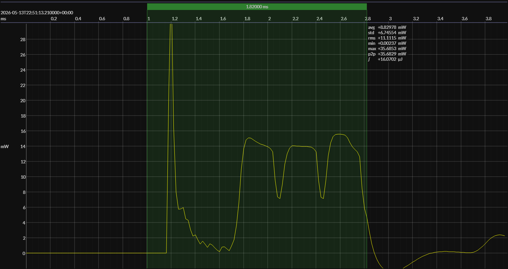

<!-- GENERATED FILE — DO NOT EDIT -->

<h1 align="center">Nordic nRF54L15 DK · EM•Script</h1>
<h3 align="center">50% SOC</h3>

captured on 2026-05-13 @ 22:38:27 generated on 2026-07-30 @ 02:24:29

## Platform

- MCU: Nordic nRF54L15
- CPU: Arm Cortex-M33, 128 MHz
- Flash: 1.5 MB
- SRAM: 256 KB
- Board: Nordic nRF54L15 DK
- Software environment: EM•Script
- EM•Script SDK: 26.2.0

### References

- [nRF54L15 product page](https://www.nordicsemi.com/Products/nRF54L15)
- [nRF54L15 DK](https://www.nordicsemi.com/Products/Development-hardware/nRF54L15-DK)
- [EM•Script project](https://github.com/em-foundation/emporium)

## Power Source

- Manufacturer: Energizer
- Battery type: CR2032
- Model temperature: 25 °C
- Power source: modeled battery
- Battery-model provider: Qoitech Otii
- Note: provisional declaration for historical BlueJoule-ADV captures; exact model metadata has not yet been confirmed

## EM&bull;Scope results · Otii3

### 🟠&ensp;measured voltage

| &emsp;average&emsp; | &emsp;minimum&emsp; | &emsp;maximum&emsp; | &emsp;standard deviation&emsp;
|:---:|:---:|:---:|:---:|
| 2.941 V | 2.852 V | 2.957 V | 0.002 V |

### 🟠&ensp;sleep

| supply voltage | &emsp;current (avg)&emsp; | &emsp;current (std)&emsp; | &emsp;average power&emsp;
|:---:|:---:|:---:|:---:|
| 2.9 V |  0.8 µA |  3.8 µA |  2.4 µW |

### 🟠&ensp;1&thinsp;s event period

| &emsp;&emsp;event energy (avg)&emsp;&emsp; | &emsp;&emsp;energy per period&emsp;&emsp; | &emsp;&emsp;energy per day&emsp;&emsp; | &emsp;&emsp;&emsp;**EM&bull;eralds**&emsp;&emsp;&emsp;
|:---:|:---:|:---:|:---:|
| 16.5 µJ | 18.9 µJ |  1.6 J | 49.08 |

### 🟠&ensp;10&thinsp;s event period

| &emsp;&emsp;event energy (avg)&emsp;&emsp; | &emsp;&emsp;energy per period&emsp;&emsp; | &emsp;&emsp;energy per day&emsp;&emsp; | &emsp;&emsp;&emsp;**EM&bull;eralds**&emsp;&emsp;&emsp;
|:---:|:---:|:---:|:---:|
| 16.5 µJ | 40.2 µJ |  0.3 J | 230.40 |

## Typical Event

