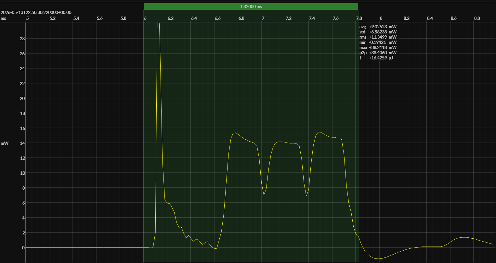

<!-- GENERATED FILE — DO NOT EDIT -->

<h1 align="center">Nordic nRF54L15 DK · EM•Script</h1>
<h3 align="center">90% SOC</h3>

captured on 2026-05-13 @ 22:36:24 generated on 2026-08-13 @ 14:48:27

## Activity

- Activity: Bluetooth Low Energy legacy advertising
- Advertising type: non-connectable, non-scannable (`ADV_NONCONN_IND`)
- PHY: LE 1M
- Advertising channels: 37, 38, and 39
- TX power: 0 dBm
- Advertising interval: 1 s
- Advertising payload length: 19 bytes
- Advertising event: one back-to-back transmission on each of channels 37, 38, and 39
- Flags: LE General Discoverable; BR/EDR not supported
- Local name: `BlueJoule`
- Manufacturer ID: Novel Bits (`0x08D3`)
- Manufacturer data: `0xFF`
- Conformance basis: observable over-the-air behavior, not a canonical source implementation
- Measurement result: average event energy and average event duration derived from repeated detected events
- Sleep model: time outside the measured event is treated as sleep for period and daily-energy projections

## Platform

- MCU: Nordic nRF54L15
- CPU: Arm Cortex-M33, 128 MHz
- Flash: 1.5 MB
- SRAM: 256 KB
- Board: Nordic nRF54L15 DK
- Software environment: EM•Script
- EM•Script SDK: 26.2.0

### References

- [nRF54L15 product page](https://www.nordicsemi.com/Products/nRF54L15)
- [nRF54L15 DK](https://www.nordicsemi.com/Products/Development-hardware/nRF54L15-DK)
- [EM•Script project](https://github.com/em-foundation/emporium)

## Power Source

- Manufacturer: Energizer
- Battery type: CR2032
- Model temperature: 25 °C
- Power source: modeled battery
- Battery-model provider: Qoitech Otii
- Note: provisional declaration for historical BlueJoule-ADV captures; exact model metadata has not yet been confirmed

## EM&bull;Scope results · Otii3

### 🟠&ensp;measured voltage

| &emsp;average&emsp; | &emsp;minimum&emsp; | &emsp;maximum&emsp; | &emsp;standard deviation&emsp;
|:---:|:---:|:---:|:---:|
| 2.964 V | 2.874 V | 2.978 V | 0.001 V |

### 🟠&ensp;sleep

| supply voltage | &emsp;current (avg)&emsp; | &emsp;current (std)&emsp; | &emsp;average power&emsp;
|:---:|:---:|:---:|:---:|
| 3.0 V |  0.8 µA |  3.6 µA |  2.5 µW |

### 🟠&ensp;1&thinsp;s event period

| &emsp;&emsp;event energy (avg)&emsp;&emsp; | &emsp;&emsp;event energy (std)&emsp;&emsp; | &emsp;&emsp;energy per period&emsp;&emsp; | &emsp;&emsp;energy per day&emsp;&emsp; | &emsp;&emsp;&emsp;**EM&bull;eralds**&emsp;&emsp;&emsp;
|:---:|:---:|:---:|:---:|:---:|
| 16.6 µJ |  0.1 µJ | 19.1 µJ |  1.6 J | 48.54 |

### 🟠&ensp;10&thinsp;s event period

| &emsp;&emsp;event energy (avg)&emsp;&emsp; | &emsp;&emsp;event energy (std)&emsp;&emsp; | &emsp;&emsp;energy per period&emsp;&emsp; | &emsp;&emsp;energy per day&emsp;&emsp; | &emsp;&emsp;&emsp;**EM&bull;eralds**&emsp;&emsp;&emsp;
|:---:|:---:|:---:|:---:|:---:|
| 16.6 µJ |  0.1 µJ | 41.3 µJ |  0.4 J | 224.06 |

## Typical Event

