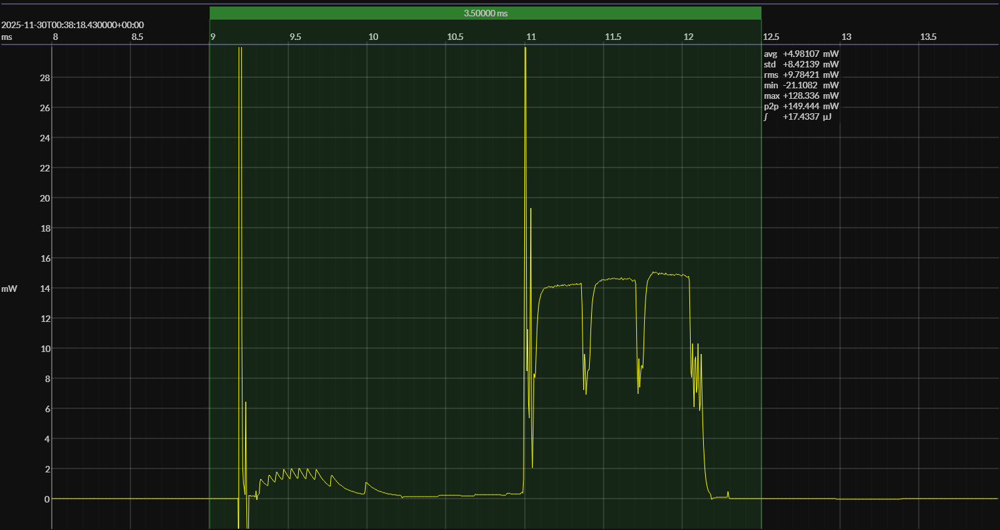

<!-- GENERATED FILE — DO NOT EDIT -->

<h1 align="center">Nordic nRF54L15 DK · Zephyr · NCS 3.1.1 · Retain 16 KB</h1>
<h3 align="center">Bench supply · 3V0</h3>

captured on 2025-11-30 @ 00:36:13 generated on 2026-08-13 @ 14:47:36

## Activity

- Activity: Bluetooth Low Energy legacy advertising
- Advertising type: non-connectable, non-scannable (`ADV_NONCONN_IND`)
- PHY: LE 1M
- Advertising channels: 37, 38, and 39
- TX power: 0 dBm
- Advertising interval: 1 s
- Advertising payload length: 19 bytes
- Advertising event: one back-to-back transmission on each of channels 37, 38, and 39
- Flags: LE General Discoverable; BR/EDR not supported
- Local name: `BlueJoule`
- Manufacturer ID: Novel Bits (`0x08D3`)
- Manufacturer data: `0xFF`
- Conformance basis: observable over-the-air behavior, not a canonical source implementation
- Measurement result: average event energy and average event duration derived from repeated detected events
- Sleep model: time outside the measured event is treated as sleep for period and daily-energy projections

## Platform

- MCU: Nordic nRF54L15
- CPU: Arm Cortex-M33, 128 MHz
- Flash: 1.5 MB
- SRAM: 256 KB
- Board: Nordic nRF54L15 DK
- Software stack: Zephyr
- nRF Connect SDK: 3.1.1
- Toolchain: nRF Connect SDK Toolchain 3.1.1
- Advertising mode: legacy non-connectable broadcaster
- Retained SRAM: 16 KB
- SRAM base address: `0x2003C000`
- RRAM low-power power-off: enabled
- Serial and console support: disabled
- Thread and system stack sizes: reduced for this benchmark configuration

### References

- [nRF54L15 product page](https://www.nordicsemi.com/Products/nRF54L15)
- [nRF54L15 DK](https://www.nordicsemi.com/Products/Development-hardware/nRF54L15-DK)
- [nRF Connect SDK](https://www.nordicsemi.com/Products/Development-software/nRF-Connect-SDK)
- [BUILD ARTIFACTS](../build)

## Power Source

- Power source: regulated bench supply
- State of charge: not applicable
- Battery model: none

## EM&bull;Scope results · JS220

### 🟠&ensp;measured voltage

| &emsp;average&emsp; | &emsp;minimum&emsp; | &emsp;maximum&emsp; | &emsp;standard deviation&emsp;
|:---:|:---:|:---:|:---:|
| 2.998 V | 2.970 V | 3.003 V | 0.001 V |

### 🟠&ensp;sleep

| supply voltage | &emsp;current (avg)&emsp; | &emsp;current (std)&emsp; | &emsp;average power&emsp;
|:---:|:---:|:---:|:---:|
| 3.0 V |  1.9 µA |  0.8 µA |  5.7 µW |

### 🟠&ensp;1&thinsp;s event period

| &emsp;&emsp;event energy (avg)&emsp;&emsp; | &emsp;&emsp;event energy (std)&emsp;&emsp; | &emsp;&emsp;energy per period&emsp;&emsp; | &emsp;&emsp;energy per day&emsp;&emsp; | &emsp;&emsp;&emsp;**EM&bull;eralds**&emsp;&emsp;&emsp;
|:---:|:---:|:---:|:---:|:---:|
| 17.5 µJ |  0.1 µJ | 23.1 µJ |  2.0 J | 40.05 |

### 🟠&ensp;10&thinsp;s event period

| &emsp;&emsp;event energy (avg)&emsp;&emsp; | &emsp;&emsp;event energy (std)&emsp;&emsp; | &emsp;&emsp;energy per period&emsp;&emsp; | &emsp;&emsp;energy per day&emsp;&emsp; | &emsp;&emsp;&emsp;**EM&bull;eralds**&emsp;&emsp;&emsp;
|:---:|:---:|:---:|:---:|:---:|
| 17.5 µJ |  0.1 µJ | 74.0 µJ |  0.6 J | 125.10 |

## Typical Event

