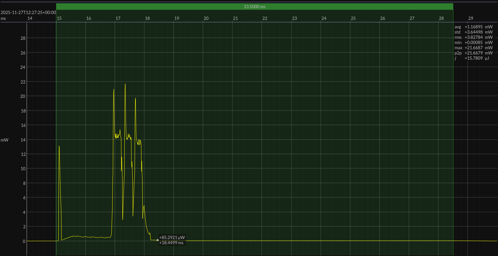

<!-- GENERATED FILE — DO NOT EDIT -->

<h1 align="center">Nordic nRF54L15 DK · Zephyr · NCS 3.1.1 · Retain 16 KB</h1>
<h3 align="center">Bench supply · 1V8</h3>

captured on 2025-11-27 @ 11:24:34 generated on 2026-07-30 @ 01:11:11

## Platform

- MCU: Nordic nRF54L15
- CPU: Arm Cortex-M33, 128 MHz
- Flash: 1.5 MB
- SRAM: 256 KB
- Board: Nordic nRF54L15 DK
- Software stack: Zephyr
- nRF Connect SDK: 3.1.1
- Toolchain: nRF Connect SDK Toolchain 3.1.1
- Advertising mode: legacy non-connectable broadcaster
- Retained SRAM: 16 KB
- SRAM base address: `0x2003C000`
- RRAM low-power power-off: enabled
- Serial and console support: disabled
- Thread and system stack sizes: reduced for this benchmark configuration

### References

- [nRF54L15 product page](https://www.nordicsemi.com/Products/nRF54L15)
- [nRF54L15 DK](https://www.nordicsemi.com/Products/Development-hardware/nRF54L15-DK)
- [nRF Connect SDK](https://www.nordicsemi.com/Products/Development-software/nRF-Connect-SDK)
- [BUILD ARTIFACTS](../build)

## EM&bull;Scope results · PPK2

### 🟠&ensp;sleep

| supply voltage | &emsp;current (avg)&emsp; | &emsp;current (std)&emsp; | &emsp;average power&emsp;
|:---:|:---:|:---:|:---:|
| 1.8 V |  1.0 µA |  0.8 µA |  1.8 µW |

### 🟠&ensp;1&thinsp;s event period

| &emsp;&emsp;event energy (avg)&emsp;&emsp; | &emsp;&emsp;energy per period&emsp;&emsp; | &emsp;&emsp;energy per day&emsp;&emsp; | &emsp;&emsp;&emsp;**EM&bull;eralds**&emsp;&emsp;&emsp;
|:---:|:---:|:---:|:---:|
| 15.8 µJ | 17.7 µJ |  1.5 J | 52.36 |

### 🟠&ensp;10&thinsp;s event period

| &emsp;&emsp;event energy (avg)&emsp;&emsp; | &emsp;&emsp;energy per period&emsp;&emsp; | &emsp;&emsp;energy per day&emsp;&emsp; | &emsp;&emsp;&emsp;**EM&bull;eralds**&emsp;&emsp;&emsp;
|:---:|:---:|:---:|:---:|
| 15.8 µJ | 34.3 µJ |  0.3 J | 270.15 |

## Typical Event

