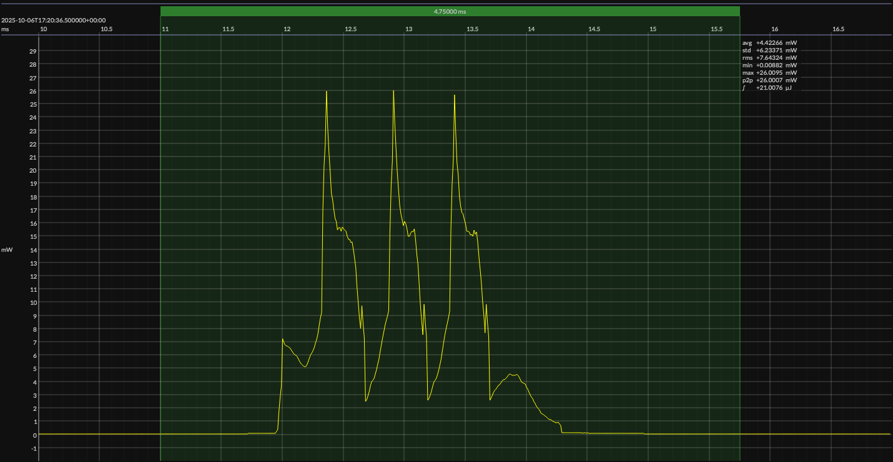

<!-- GENERATED FILE — DO NOT EDIT -->

<h1 align="center">Silicon Labs EFR32xG22E Energy Harvesting Explorer Kit · Simplicity Studio</h1>
<h3 align="center">Bench supply · 3V3</h3>

captured on 2025-08-30 @ 02:18:10 generated on 2026-08-13 @ 14:48:42

## Activity

- Activity: Bluetooth Low Energy legacy advertising
- Advertising type: non-connectable, non-scannable (`ADV_NONCONN_IND`)
- PHY: LE 1M
- Advertising channels: 37, 38, and 39
- TX power: 0 dBm
- Advertising interval: 1 s
- Advertising payload length: 19 bytes
- Advertising event: one back-to-back transmission on each of channels 37, 38, and 39
- Flags: LE General Discoverable; BR/EDR not supported
- Local name: `BlueJoule`
- Manufacturer ID: Novel Bits (`0x08D3`)
- Manufacturer data: `0xFF`
- Conformance basis: observable over-the-air behavior, not a canonical source implementation
- Measurement result: average event energy and average event duration derived from repeated detected events
- Sleep model: time outside the measured event is treated as sleep for period and daily-energy projections

## Platform

- Board: Silicon Labs EFR32xG22E Energy Harvesting Explorer Kit
- MCU: Silicon Labs EFR32xG22E
- CPU: 76.8 MHz Arm Cortex-M33
- Flash: 512 KB
- SRAM: 32 KB
- Development environment: Simplicity Studio
- Simplicity Studio: 5

### References

- [xG22-EK8200A](https://www.silabs.com/development-tools/wireless/efr32xg22e-energy-harvesting-explorer-kit?tab=overview)
- [EFR32xG22E SoC](https://www.silabs.com/wireless/bluetooth/efr32bg22-series-2-socs)
- [Simplicity Studio](https://www.silabs.com/software-and-tools/simplicity-studio/simplicity-studio-version-5)
- [BUILD ARTIFACTS](../build)

## Power Source

- Power source: regulated bench supply
- State of charge: not applicable
- Battery model: none

## EM&bull;Scope results · PPK2

### 🟠&ensp;sleep

| supply voltage | &emsp;current (avg)&emsp; | &emsp;current (std)&emsp; | &emsp;average power&emsp;
|:---:|:---:|:---:|:---:|
| 1.8 V |  4.4 µA |  0.6 µA |  7.9 µW |

### 🟠&ensp;1&thinsp;s event period

| &emsp;&emsp;event energy (avg)&emsp;&emsp; | &emsp;&emsp;event energy (std)&emsp;&emsp; | &emsp;&emsp;energy per period&emsp;&emsp; | &emsp;&emsp;energy per day&emsp;&emsp; | &emsp;&emsp;&emsp;**EM&bull;eralds**&emsp;&emsp;&emsp;
|:---:|:---:|:---:|:---:|:---:|
| 21.0 µJ |  0.2 µJ | 28.8 µJ |  2.5 J | 32.15 |

### 🟠&ensp;10&thinsp;s event period

| &emsp;&emsp;event energy (avg)&emsp;&emsp; | &emsp;&emsp;event energy (std)&emsp;&emsp; | &emsp;&emsp;energy per period&emsp;&emsp; | &emsp;&emsp;energy per day&emsp;&emsp; | &emsp;&emsp;&emsp;**EM&bull;eralds**&emsp;&emsp;&emsp;
|:---:|:---:|:---:|:---:|:---:|
| 21.0 µJ |  0.2 µJ | 99.6 µJ |  0.9 J | 92.99 |

## Typical Event

