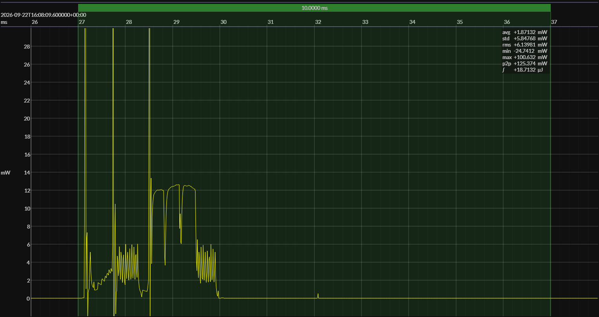

<!-- GENERATED FILE — DO NOT EDIT -->

<h1 align="center">STMicro STM32WBA25 · STM32CubeWBA</h1>
<h3 align="center">Bench supply · 1V8</h3>

captured on 2026-04-15 @ 21:13:18 generated on 2026-07-30 @ 01:11:16

## Platform

- Board: NUCLEO-WBA25CE1
- MCU: STM32WBA25CEU7
- CPU: 64 MHz Arm Cortex-M33
- Flash: 512 KB
- SRAM: 96 KB
- SDK: STM32CubeWBA 1.9.0
- Benchmark application: BlueJoule-ADV, 1 s advertising interval

### References

- [NUCLEO-WBA25CE1](https://www.st.com/en/evaluation-tools/nucleo-wba25ce1.html)
- [Board pinout and CAD resources](https://www.st.com/en/evaluation-tools/nucleo-wba25ce1.html#cad-resources)
- [STM32WBA25CEU7](https://www.st.com/en/microcontrollers-microprocessors/stm32wba25ce.html)
- [STM32CubeWBA](https://www.st.com/en/embedded-software/stm32cubewba.html)
- [BUILD ARTIFACTS](../build)

## EM&bull;Scope results · JS220

### 🟠&ensp;measured voltage

| &emsp;average&emsp; | &emsp;minimum&emsp; | &emsp;maximum&emsp; | &emsp;standard deviation&emsp;
|:---:|:---:|:---:|:---:|
| 1.803 V | 1.789 V | 1.808 V | 0.001 V |

### 🟠&ensp;sleep

| supply voltage | &emsp;current (avg)&emsp; | &emsp;current (std)&emsp; | &emsp;average power&emsp;
|:---:|:---:|:---:|:---:|
| 1.8 V |  0.9 µA |  0.6 µA |  1.6 µW |

### 🟠&ensp;1&thinsp;s event period

| &emsp;&emsp;event energy (avg)&emsp;&emsp; | &emsp;&emsp;energy per period&emsp;&emsp; | &emsp;&emsp;energy per day&emsp;&emsp; | &emsp;&emsp;&emsp;**EM&bull;eralds**&emsp;&emsp;&emsp;
|:---:|:---:|:---:|:---:|
| 18.4 µJ | 20.0 µJ |  1.7 J | 46.28 |

### 🟠&ensp;10&thinsp;s event period

| &emsp;&emsp;event energy (avg)&emsp;&emsp; | &emsp;&emsp;energy per period&emsp;&emsp; | &emsp;&emsp;energy per day&emsp;&emsp; | &emsp;&emsp;&emsp;**EM&bull;eralds**&emsp;&emsp;&emsp;
|:---:|:---:|:---:|:---:|
| 18.4 µJ | 34.7 µJ |  0.3 J | 267.04 |

## Typical Event

