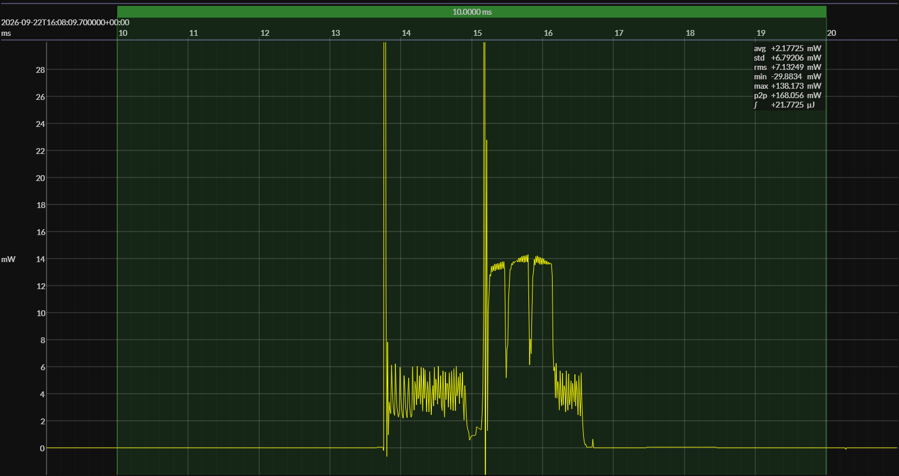

<!-- GENERATED FILE — DO NOT EDIT -->

<h1 align="center">STMicro STM32WBA25 · STM32CubeWBA</h1>
<h3 align="center">Bench supply · 3V0</h3>

captured on 2026-04-16 @ 11:49:27 generated on 2026-07-29 @ 23:23:28

## Platform

- Board: NUCLEO-WBA25CE1
- MCU: STM32WBA25CEU7
- CPU: 64 MHz Arm Cortex-M33
- Flash: 512 KB
- SRAM: 96 KB
- SDK: STM32CubeWBA 1.9.0
- Benchmark application: BlueJoule-ADV, 1 s advertising interval

### References

- [NUCLEO-WBA25CE1](https://www.st.com/en/evaluation-tools/nucleo-wba25ce1.html)
- [Board pinout and CAD resources](https://www.st.com/en/evaluation-tools/nucleo-wba25ce1.html#cad-resources)
- [STM32WBA25CEU7](https://www.st.com/en/microcontrollers-microprocessors/stm32wba25ce.html)
- [STM32CubeWBA](https://www.st.com/en/embedded-software/stm32cubewba.html)
- [BUILD ARTIFACTS](../build)

## EM&bull;Scope results · JS220

### 🟠&ensp;sleep

| supply voltage | &emsp;current (avg)&emsp; | &emsp;current (std)&emsp; | &emsp;average power&emsp;
|:---:|:---:|:---:|:---:|
| 3.0 V |  1.0 µA |  0.5 µA |  3.1 µW |

### 🟠&ensp;1&thinsp;s event period

| &emsp;&emsp;event energy (avg)&emsp;&emsp; | &emsp;&emsp;energy per period&emsp;&emsp; | &emsp;&emsp;energy per day&emsp;&emsp; | &emsp;&emsp;&emsp;**EM&bull;eralds**&emsp;&emsp;&emsp;
|:---:|:---:|:---:|:---:|
| 21.3 µJ | 24.4 µJ |  2.1 J | 37.98 |

### 🟠&ensp;10&thinsp;s event period

| &emsp;&emsp;event energy (avg)&emsp;&emsp; | &emsp;&emsp;energy per period&emsp;&emsp; | &emsp;&emsp;energy per day&emsp;&emsp; | &emsp;&emsp;&emsp;**EM&bull;eralds**&emsp;&emsp;&emsp;
|:---:|:---:|:---:|:---:|
| 21.3 µJ | 51.9 µJ |  0.4 J | 178.55 |

## Typical Event

