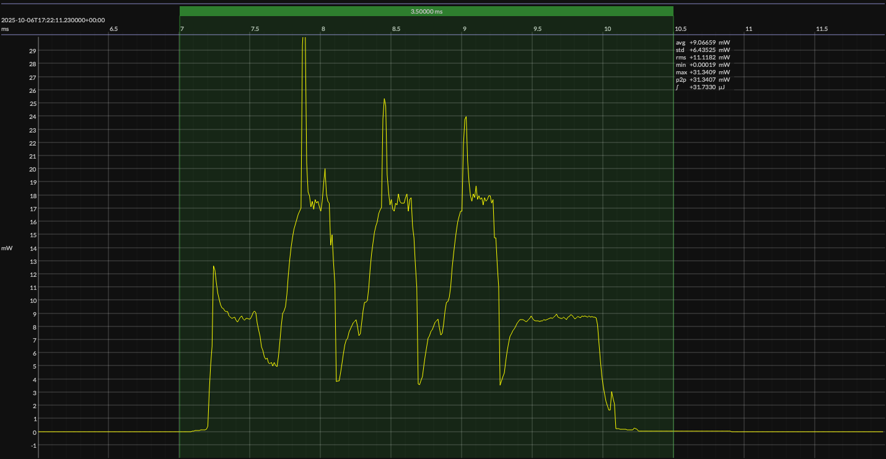

<!-- GENERATED FILE — DO NOT EDIT -->

<h1 align="center">Texas Instruments CC2340R5 LaunchPad · SimpleLink SDK</h1>
<h3 align="center">Bench supply · 3V3</h3>

captured on 2025-08-16 @ 02:55:34 generated on 2026-07-30 @ 01:11:24

## Platform

- Board: Texas Instruments CC2340R5 LaunchPad
- MCU: Texas Instruments CC2340R5
- CPU: 48 MHz Arm Cortex-M0+
- Flash: 512 KB
- SRAM: 64 KB
- Development environment: Code Composer Studio IDE
- Code Composer Studio IDE: 12.4.0
- Compiler: TI Arm Clang 2.1.3
- SimpleLink SDK: 8.10.0

### References

- [LP-EM-CC2340R5 Development Kit](https://www.ti.com/tool/LP-EM-CC2340R5)
- [CC2340R5 SoC](https://www.ti.com/product/CC2340R5)
- [Code Composer Studio IDE](https://www.ti.com/tool/CCSTUDIO)
- [TI Arm Clang compiler](https://www.ti.com/tool/download/ARM-CGT-CLANG)
- [SimpleLink SDK](https://www.ti.com/tool/SIMPLELINK-LOWPOWER-SDK)
- [BUILD ARTIFACTS](../build)

## EM&bull;Scope results · PPK2

### 🟠&ensp;sleep

| supply voltage | &emsp;current (avg)&emsp; | &emsp;current (std)&emsp; | &emsp;average power&emsp;
|:---:|:---:|:---:|:---:|
| 3.3 V |  0.7 µA |  2.7 µA |  2.2 µW |

### 🟠&ensp;1&thinsp;s event period

| &emsp;&emsp;event energy (avg)&emsp;&emsp; | &emsp;&emsp;energy per period&emsp;&emsp; | &emsp;&emsp;energy per day&emsp;&emsp; | &emsp;&emsp;&emsp;**EM&bull;eralds**&emsp;&emsp;&emsp;
|:---:|:---:|:---:|:---:|
| 31.7 µJ | 33.9 µJ |  2.9 J | 27.31 |

### 🟠&ensp;10&thinsp;s event period

| &emsp;&emsp;event energy (avg)&emsp;&emsp; | &emsp;&emsp;energy per period&emsp;&emsp; | &emsp;&emsp;energy per day&emsp;&emsp; | &emsp;&emsp;&emsp;**EM&bull;eralds**&emsp;&emsp;&emsp;
|:---:|:---:|:---:|:---:|
| 31.7 µJ | 53.3 µJ |  0.5 J | 173.63 |

## Typical Event

